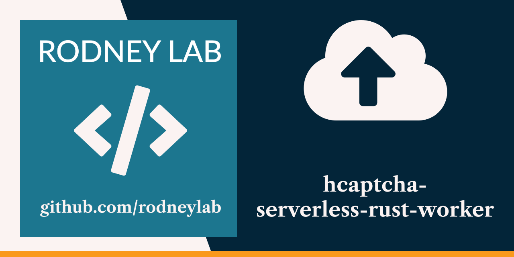

<p align="center">
  <a aria-label="Open Rodney Lab site" href="https://rodneylab.com" rel="nofollow noopener noreferrer">
    
  </a>
</p>
<h1 align="center">
  hCaptcha Serverless Rust Worker
</h1>

# hcaptcha-serverless-rust-worker

[](https://open.vscode.dev/rodneylab/hcaptcha-serverless-rust-worker)

Cloudflare Worker written in Rust to create an hCaptcha verification endpoint.

To learn how to code this up from scratch in Rust using wrangler, see the <a aria-label="Open Rodney Lab blog post on using Rust Cloud flare Workers" href="https://rodneylab.com/using-rust-cloudflare-workers/">article on using Rust in serverless Cloudflare workers</a>. If you have any questions, please drop a comment at the bottom of that page.

If you would like to use the Worker read on!

You will need a Cloudflare account as well as an hCaptcha account.  Both services have a free tier.

1. Start by cloning this repo:

    ```shell
    git clone https://github.com/rodneylab/hcaptcha-serverless-rust-worker
    cd hcaptcha-serverless-rust-worker
    ```

1. Continue by <a aria-label="Create a Cloudflare account" href="https://dash.cloudflare.com/sign-up">setting up a Cloudflare account</a> if you do not yet have one.

1. Now <a aria-label="Visit the h captcha site to create an account" href="https://www.hcaptcha.com/">create an hCaptcha account</a>, if you don't yet have one.

1. If you do not yet have a Rust development environment set up on your machine,  <a aria-label="See recommended rust up installation instructions" href="https://www.rust-lang.org/tools/install">head over to the official Rust site for the recommended one-line terminal command</a> to get that up and running.

1. Install the wrangler tool on your machine:

    ```shell
    cargo install wrangler
    ```

1. Next link your Cloudflare account to your local environment:

    ```shell
    wrangler login
    ```

1. Now we will define some variables.  Start with your hCaptcha site key (get this from the hCaptcha dashboard):

    ```
    wrangler secret put HCAPTCHA_SITEKEY
    ```

    paste in your site key when prompted.

1. Repeat with your hCaptcha secret key

    ```
    wrangler secret put HCAPTCHA_SECRETKEY
    ```

1. Finally we will define the CORS origins.  This is a comma separated list of valid domains you want to be able to send requests from (typically your live client site and a local development site).  If you have the the following domains:

    - https://www.example.com,
    - http://127.0.0.1:3000,


    Enter the secret as `https://www.example.com,http://127.0.0.1:3000` when prompted.
    
    Let's define this now then:

    ```
    wrangler secret put CORS_ORIGIN
    ```

That should be everything set up.

## Testing 
1. Now fire up the dev server for testing:

    ```
    wrangler dev
    ```

    By default the worker will be available locally at `http://127.0.0.1:8787`.

1. Now you need to generate an hCaptcha request from a client app and send it to `http://127.0.0.1:8787/verify` as JSON, using the  `POST` method.  If you are working in JavaScript, you might code this up something like this:

```javascript
  async function handleVerify() {
    try {
      if (browser) {
        const { response } = await hcaptcha.execute(hcaptchaWidgetID, {
          async: true,
        });
        const responsePromise = fetch(\`\${workerUrl}/verify\`, {
          method: 'POST',
          credentials: 'omit',
          headers: {
            'Content-Type': 'application/json',
          },
          body: JSON.stringify({
            response,
          }),
        });
      }
    } catch (error) {
      console.error(\`Error in handleVerify: \${error}\`);
    }
  }
```
